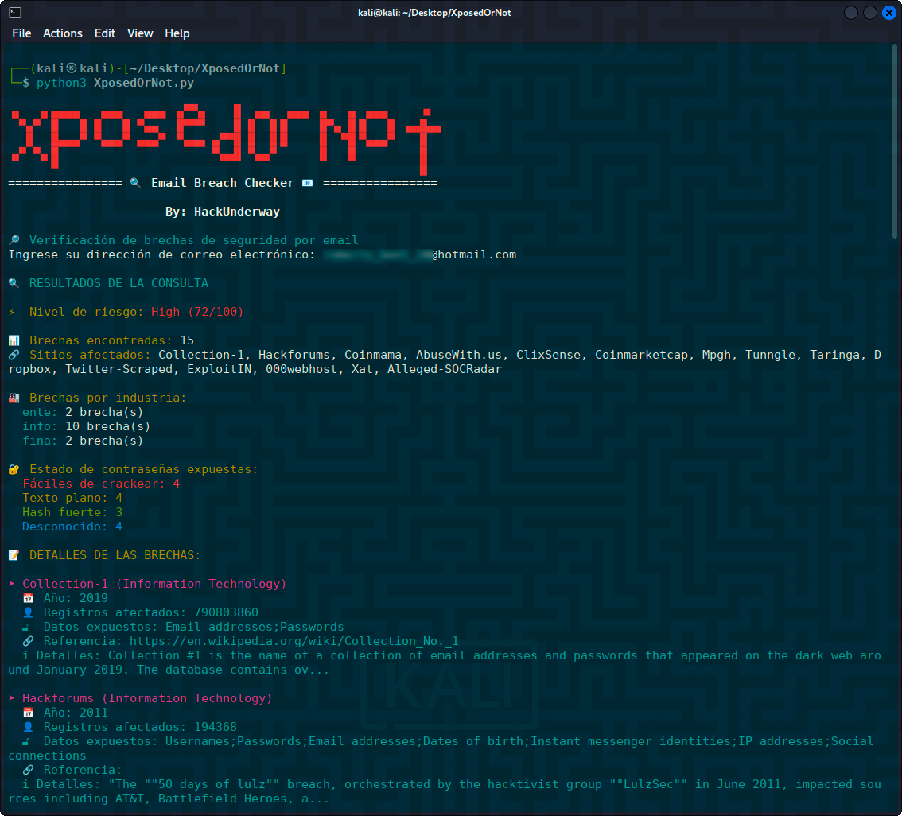

<h1 align="center">XposedOrNot 👨🏽‍💻</h1>

<p align="center">
  Herramienta para verificar si un correo electrónico ha sido comprometido en brechas de datos conocidas, utilizando la API de [XposedOrNot](https://api.xposedornot.com).
</p>

<p align="center">
  
</p>

<p align="center">
  
  
</p>

---

## 🚀 Características

- ✔️ Verificación de correos en múltiples brechas de datos
- ✔️ Detección de nivel de riesgo (Alto, Medio, Bajo)
- ✔️ Información detallada por cada brecha encontrada
- ✔️ Estadísticas de contraseñas expuestas
- ✔️ Interfaz colorida y fácil de leer
- ✔️ Soporte para verificación por industria

## 📌 Requisitos

- Python 3.11+

- Librerías: `requests`, `colorama`

## ⚠️ Advertencia

#### Esta herramienta solo debe usarse para:

- ✅ Verificar tus propios emails

- ✅ Con fines educativos

- ✅ Auditorías de seguridad autorizadas

- ✅ Investigaciones OSINT

###### No se recomienda su uso para violar privacidad o realizar actividades ilegales.

## 🛡️ Privacidad

- La herramienta no almacena ningún dato

- Las consultas se realizan directamente a la API pública

- Se recomienda usar con precaución en entornos sensibles

---
## ⚙️ Instalación

Clona el repositorio:

```bash
git clone https://github.com/HackUnderway/XposedOrNot.git
```
```bash
cd XposedOrNot
```
```bash
pip install -r requirements.txt
```

## 🚀 Uso
##### Pones este comando en tu terminal
python3 XposedOrNot.py

##### Ingresas el email que quieras consultar
email_de_prueba_para_osint@hotmail.com
email_de_prueba_para_osint@gmail.com

> **El proyecto está abierto a colaboradores.**

# DISTRIBUCIONES SOPORTADAS
|Distribución | Versión verificada | 	¿Soportado? | 	Estado |
|--------------|--------------------|------|-------|
|Kali Linux| 2025.1| si| funcionando   |
|Parrot Security OS| 6.2| si | funcionando   |
|Windows| 11 | si | funcionando   |
|BackBox| 9 | si | funcionando   |
|Arch Linux| 2024.12.01 | si | funcionando   |

# SOPORTE
Preguntas, errores o sugerencias: info@hackunderway.com

# LICENSE
- [x] XposedOrNot tiene licencia.
- [x] Consulta el archivo [LICENSE](https://github.com/HackUnderway/XposedOrNot#MIT-1-ov-file) para más información.

# CYBERSECURITY RESEARCHER

* [Victor Bancayan](https://www.offsec.com/bug-bounty-program/) - (**CEO at [Hack Underway](https://www.instagram.com/hackunderway/)**) 

## 🔗 ENLACES
[](https://www.patreon.com/c/HackUnderway)
```
Fanpage: https://www.facebook.com/HackUnderway
X: https://x.com/JeyZetaOficial
Web site: https://hackunderway.com
Youtube: https://www.youtube.com/@JeyZetaOficial
```
## 🌞 Suscripciones

###### Suscríbete: [Jey Zeta](https://www.facebook.com/JeyZetaOficial/subscribe/)

[](https://www.kali.org/)

from  made in  with  by: <font color="red">Victor Bancayan</font>, if you want Donate <a href="https://www.buymeacoffee.com/HackUnderway"></a>

© 2025
